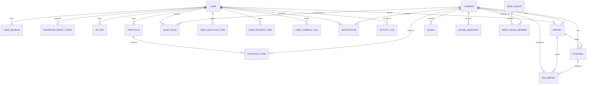

# Aryan Database Schema

The production Node backend uses Prisma with SQLite by default. `DATABASE_URL` can be changed to a supported production database during deployment. The authoritative schema is `backend-node/prisma/schema.prisma`.

## Tables

| Table | Primary fields | Relationships and constraints |
|---|---|---|
| `User` | `id`, unique `email`, password/Google identity, profile and preference fields, admin/active flags | Parent of sessions, resets, keys, reports, portfolio, alerts, saved items, notifications, and audit logs. |
| `UserSession` | `id`, `userId`, unique `tokenHash`, expiry/revocation metadata | Many sessions per user; cascade delete with user. Raw tokens are never stored. |
| `PasswordResetToken` | `id`, `userId`, unique `tokenHash`, expiry and used timestamp | Many reset requests per user; cascade delete with user. |
| `ApiKey` | `id`, `userId`, unique `keyHash`, prefix, scopes, expiry | Many API keys per user; raw key is returned only at creation. |
| `Company` | `id`, name, unique optional `ticker`, market and profile fields | Parent of ESG records, reports, signals, score snapshots, portfolio items, alert rules, tags, and peer memberships. |
| `Report` | `id`, `companyId`, optional `userId`, file/status/extraction fields, unique optional share token | A report belongs to a company and optionally its uploader; deleting a company cascades its reports. |
| `Evidence` | `id`, `companyId`, optional `reportId`, source metadata, text, category/confidence | Belongs to company; optionally source report; supports zero or more ESG metrics. |
| `ESGMetric` | `id`, `companyId`, optional `reportId` and `evidenceId`, pillar/value/unit/year | Links a measured value to company, source report, and evidence when available. |
| `Signal` | `id`, `companyId`, category/sentiment/severity/source | Belongs to company and contributes to scoring. |
| `ScoreSnapshot` | `id`, `companyId`, ESG/momentum/AI/risk/confidence/classification fields | Timestamped company score history. |
| `UserWatchlistItem` | `id`, `userId`, `companyId` | Unique `(userId, companyId)` avoids duplicate watchlist entries. |
| `UserFavoriteItem` | `id`, `userId`, `companyId` | Unique `(userId, companyId)` avoids duplicate favorites. |
| `Notification` | `id`, `userId`, optional `companyId`, delivery/read metadata | Belongs to a user and optionally the relevant company. |
| `Portfolio` | `id`, `userId`, name/default metadata | Belongs to user; owns portfolio items. |
| `PortfolioItem` | `id`, `portfolioId`, `companyId`, shares/cost/notes | Unique `(portfolioId, companyId)` prevents duplicate positions. |
| `AlertRule` | `id`, `userId`, optional `companyId`, trigger/threshold/operator | User rule scoped to all companies or one company. |
| `ActivityLog` | `id`, optional `userId`, action/entity/request metadata | Retained audit record; user reference is optional. |
| `UserCompanyTag` | `id`, `userId`, `companyId`, tag | Unique `(userId, companyId, tag)` preserves one label instance. |
| `PeerGroup` | `id`, name, description, industry | Parent of peer-group memberships. |
| `PeerGroupMember` | `id`, `peerGroupId`, `companyId` | Unique `(peerGroupId, companyId)` prevents repeated membership. |