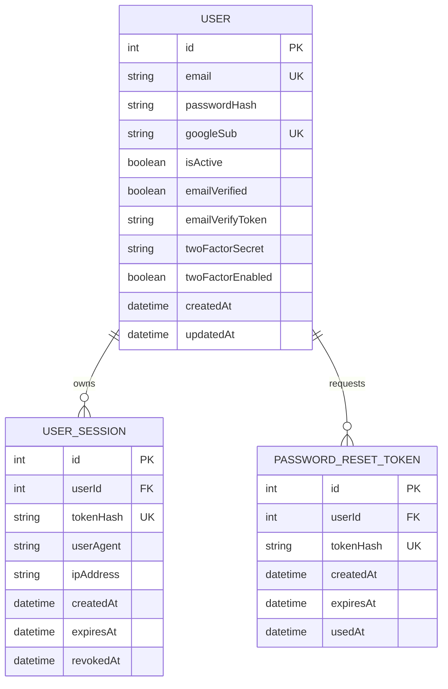

# Neelaansh Database Schema: Authentication and Sessions

The authoritative schema is `backend-node/prisma/schema.prisma`. This document describes the authentication-related records used by Neelaansh’s contribution.

## `User`

| Field | Type / constraint | Purpose |
|---|---|---|
| `id` | Integer primary key, auto-increment | User identity. |
| `email` | Unique string | Normalized account identifier. |
| `passwordHash` | Nullable string | PBKDF2-derived password representation; never returned by the API. |
| `googleSub` | Nullable unique string | Google identity subject for linked Google sign-in. |
| `isActive` | Boolean, defaults true | Blocks login for deactivated accounts. |
| `emailVerified` | Boolean, defaults false | Verification state. |
| `emailVerifyToken` | Nullable string | Hash of the pending email verification token. |
| `twoFactorSecret` | Nullable string | Base32 TOTP secret while 2FA is configured. |
| `twoFactorEnabled` | Boolean, defaults false | Indicates that TOTP verification completed. |
| `createdAt`, `updatedAt` | Timestamps | Record lifecycle metadata. |

The `User` record also owns watchlist items, favorites, reports, notifications, API keys, portfolios, alert rules, activity logs, and company tags. Those product relationships are documented in the group schema documentation.

## `UserSession`

| Field | Type / constraint | Purpose |
|---|---|---|
| `id` | Integer primary key | Session record identity. |
| `userId` | Foreign key to `User.id`, cascade delete | Session owner. |
| `tokenHash` | Unique string | SHA-256 hash of the raw session cookie value. |
| `userAgent` | Nullable string | Device/browser metadata captured at sign-in. |
| `ipAddress` | Nullable string | Request IP metadata captured at sign-in. |
| `createdAt` | Timestamp | Issue time. |
| `expiresAt` | Timestamp | Session expiry. |
| `revokedAt` | Nullable timestamp | Set on logout, password reset, or explicit session revocation. |

One user can own many sessions. The raw token appears only in the HTTP-only cookie and is never stored in this table.

## `PasswordResetToken`

| Field | Type / constraint | Purpose |
|---|---|---|
| `id` | Integer primary key | Reset request identity. |
| `userId` | Foreign key to `User.id`, cascade delete | Account that requested recovery. |
| `tokenHash` | Unique string | SHA-256 hash of the one-time reset token. |
| `createdAt` | Timestamp | Token creation time. |
| `expiresAt` | Timestamp | Recovery deadline; currently 24 hours after issue. |
| `usedAt` | Nullable timestamp | Prevents reuse after a successful reset. |

## Relationship and Security Rules

1. Deleting a user cascades to that user’s sessions and reset tokens.
2. Login creates a new `UserSession` record with a unique token hash.
3. Logout sets `revokedAt` on the active token’s session record.
4. Password reset marks one token `usedAt` and revokes every non-revoked session for that user in the same transaction.
5. Expired, revoked, or used records are retained as lifecycle metadata but are excluded from valid authentication flows.