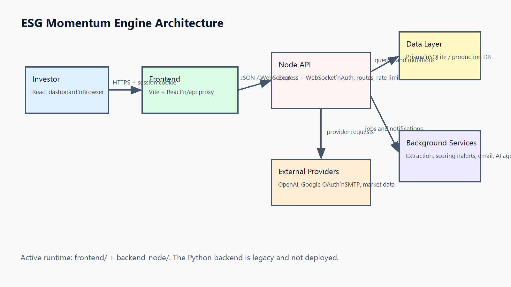
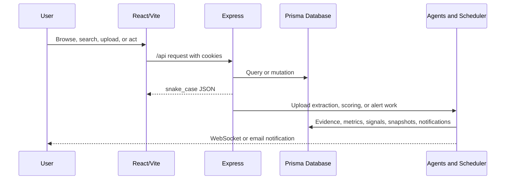

# System Architecture

## Runtime topology

1. React 18, TypeScript, Vite, Tailwind, Recharts, and Axios provide the investor interface.
2. During development, Vite listens on port `5173` and proxies `/api/*` to the Node API on port `8000`.
3. Express handles routes, HTTP-only session cookies, API-key resolution, rate limits, security headers, snake_case response conversion, and WebSocket setup.
4. Prisma reads and writes the configured SQLite database. `DATABASE_URL` can point to a production relational database.
5. Background services extract uploads, generate signals, calculate score snapshots, evaluate alerts, send email, and publish WebSocket notifications.

The Python `backend/` directory is legacy material and is not part of the supported build, run, or deployment path. The active backend is `backend-node/`.

## Main data flow

## Security boundaries

- Helmet provides HTTP security headers; CORS allows configured frontend origins with credentials.
- Passwords use PBKDF2 hashes. Session and reset tokens are persisted only as SHA-256 hashes.
- Protected routes use `requireAuth`; administrative routes additionally enforce the admin flag.
- Auth, general API, and upload traffic are independently rate-limited.
- Uploads accept PDF, TXT, and DOCX files with a 50 MB maximum.

## Deployment

Build the frontend with `npm --prefix frontend run build`; deploy `frontend/dist/` to a static host. Deploy `backend-node/` as a Node 18+ service, set production environment variables, and expose port `8000` behind TLS. Set `CORS_ORIGINS` and `FRONTEND_URL` to the deployed frontend and use persistent database and upload storage.